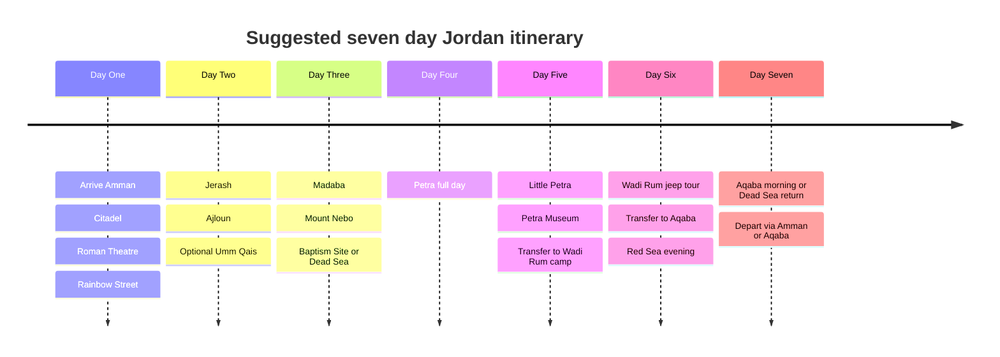

# Jordan Tourist Attractions Research Dossier and Ten Page PDF Content Plan

## Executive summary

Jordan is unusually strong as a destination because it combines globally recognized archaeology, religious heritage, desert landscapes, marine recreation, and wellness experiences in a geographically compact country. The highest-value editorial anchors for a guide are Petra, Wadi Rum, the Dead Sea, Jerash, Aqaba, Amman’s core heritage district, and Jordan’s UNESCO and eco-reserve circuit, which together give the destination both iconic recognition and itinerary depth. UNESCO currently lists seven World Heritage properties in Jordan: Petra, Quseir Amra, Um er-Rasas, Wadi Rum Protected Area, the Baptism Site at Al-Maghtas, As-Salt, and Umm Al-Jimāl. citeturn7search14turn24search7

For a ten-page guide, the strongest editorial approach is not to attempt a directory of every site on every page, but to build the narrative around a “Jordan in layers” logic: capital and urban culture, Roman and Nabataean heritage, desert and eco-adventure, Red Sea leisure, Dead Sea wellness and faith, and a final page for practical planning. That keeps the document visually persuasive while still supporting direct trip design. Official Jordan Tourism Board material already organizes the country in similar route clusters, especially Amman, Jerash/Ajloun/Umm Qais, Madaba/Mount Nebo, Petra, Wadi Rum, Aqaba, the Dead Sea, and Bethany Beyond the Jordan. citeturn3search5turn1search3

A Jordan guide produced in June 2026 should also include a current safety note, because official foreign-travel advisories for Jordan were updated in June 2026 amid regional tensions. The UK Foreign, Commonwealth & Development Office says it advises against all travel to parts of Jordan and updated the page on 18 June 2026; the U.S. State Department page says non-emergency U.S. government personnel were ordered to leave Jordan in March 2026 because of safety risks tied to regional hostilities and flight disruptions. A destination guide can still be useful, but it should explicitly instruct readers to verify current advisories, airline operations, and local conditions immediately before travel. citeturn14search1turn14search0

The core planning recommendation for most international visitors remains the Jordan Pass. Official Jordan Pass pricing at the time of research is 70 JD for the Wanderer pass, 75 JD for Explorer, and 80 JD for Expert; the pass includes entry to more than forty attractions and waives the single-entry tourist visa fee for eligible visitors who buy before arrival and stay at least two nights. Petra, Jerash, Wadi Rum, and many museums and castles are included. citeturn4search0turn4search4turn17view0

This report assumes the audience is unspecified, so the content is designed for a broad international readership: culturally curious travelers, first-time visitors, couples, mixed-age groups, and independent travelers. The layout therefore balances “must-see” highlights with enough practical detail to let a designer move directly into page production without another research round.

## Research frame and editorial assumptions

This report prioritizes English-language primary or official sources: the Jordan Tourism Board and affiliated official portals, Jordan Pass, Petra Development and Tourism Region Authority, Jordan Museums, UNESCO, the Royal Society for the Conservation of Nature, and Jordan Holy Land. Where official pages did not clearly publish an admission fee or detailed accessibility note, the report says so plainly and avoids guessing. citeturn1search12turn4search0turn15search8turn20search0turn6search10turn18search1turn23search10

The attraction durations below are editorial planning estimates intended for guide design, not legally binding or operator-issued timings. They are based on official trail lengths, museum format, published operating hours, and destination scope. For example, Petra’s official main trail is 3.9 km one way and listed at roughly 1 hour 30 minutes to 1 hour 45 minutes on the main segment alone, but the broader site is large enough that official tourism material recommends at least two to three days to explore it fully. citeturn15search12turn32search1

For best-time guidance, this report generally favors spring and autumn for archaeological and desert sites because those seasons are the most comfortable for long outdoor visits, while the Red Sea and urban museums are more year-round. For Petra specifically, official safety guidance notes summer temperatures above 35°C and limited shade beyond the Siq, reinforcing early starts and cooler-season preference. citeturn13search5turn29search12

The strongest design implication from the source material is that Jordan works best when presented as a sequence of linked contrasts: “hilltop capital to Roman north, mosaic plateau to low-salinity shore, rose-red city to red desert, reef coast to eco-reserve.” That is more compelling than a simple alphabetical list and aligns with how official Jordan itineraries are already structured. citeturn3search5turn31search16

## PDF structure and page plan

The table below is ready-to-use editorial planning content for a ten-page PDF.

| Page | Proposed headline | Content allocation | Visual plan | Sample short caption |
|---|---|---|---|---|
| Cover | **Jordan in Ten Pages** | Hero image, subhead, one-line promise, date, small note: “Audience unspecified.” | Full-bleed Petra or Wadi Rum hero; small locator map of Jordan. | “A compact country of rose-red stone, Roman cities, desert silence, and the Red Sea.” |
| Opening spread | **Why Jordan Works So Well for a Short Trip** | Executive summary, top ten highlights, one country map, UNESCO callout, Jordan Pass box. | Use official Jordan attractions map from the Visit Jordan brochure as the base visual. citeturn11view0turn9view0 | “Seven UNESCO sites, strong road connectivity, and major icons within one itinerary.” |
| Capital and north | **Amman, Jerash, Ajloun, Umm Qais** | Amman heritage core; Roman north; one “best day trip” inset. | Two medium images: Amman Citadel skyline and Jerash colonnade; use museum/history icons. | “Start in the capital, then move north into Roman and Ayyubid Jordan.” |
| Petra | **Petra Beyond the Postcard** | Petra main site, Little Petra, Petra Museum, Petra by Night, visitor strategy. | Full-width Treasury image; small trail graphic; callout for sunrise start. | “Petra rewards slow looking more than checklist tourism.” |
| Desert and eco-south | **Wadi Rum, Dana, Feynan, Shobak, Ma’an** | Desert landscapes, Bedouin experiences, eco-reserves, castle stop. | Panoramic Wadi Rum image; inset Dana escarpment image; adventure icons. | “Jordan’s south pairs monumental silence with community-based nature travel.” |
| Dead Sea and faith corridor | **Dead Sea, Mujib, Bethany, Madaba, Mount Nebo** | Wellness, canyon adventure, pilgrimage, mosaic heritage. | Split layout: Dead Sea floating image and Madaba mosaic detail; use wellness and faith icons. | “From the lowest point on earth to some of the region’s most resonant sacred sites.” |
| Red Sea | **Aqaba and the Gulf** | Beaches, diving, underwater museum, heritage fort, aquarium. | Underwater or coral image; secondary Aqaba Castle image. | “Jordan’s coast is short, but it adds reef life, warmth, and recovery time.” |
| Beyond the classic loop | **Other High Value Sites** | As-Salt, Umm Al-Jimāl, Quseir Amra, Um er-Rasas, Desert Castles, Iraq Al-Amir, Pella. | Grid of smaller images; UNESCO badges. | “For repeat visitors, these sites turn Jordan from a highlights trip into a deep cultural journey.” |
| Suggested routes | **How to See Jordan in Three or Seven Days** | Compact three-day route, fuller seven-day route, mermaid timeline, pacing notes. | Route line graphic/map, day markers, icons for drive/hike/swim/UNESCO. | “The smartest route is the one that avoids packing every icon into every day.” |
| Planning page | **Transport, Timing, Safety, Etiquette, Sources** | Airports, roads, Jordan Pass, cultural etiquette, current safety note, recommended official planning links. | Clean icon-led reference page with QR blocks or short source list. | “Check official advisories and opening details before departure.” |

A designer can keep the entire PDF visually coherent with one hero image per page, one inset detail image when needed, and icon tags for UNESCO, museum, faith site, swim, desert, eco, and accessibility. The opening spread should carry the country map because it reduces wayfinding friction for readers from the start. The official Visit Jordan brochure includes a clear nationwide attraction map with a useful legend for historic, religious, reserve, and transport markers. citeturn11view0turn9view0

## Curated attraction inventory

The comparison tables below come first because they help a designer decide how much page space each region deserves.

### Comparative summary by region

| Region | Editorial strength | Signature types | Best use in a guide | Typical time needed |
|---|---|---|---|---|
| Amman | Best entry city; strongest urban culture and museum base. citeturn1search6turn20search2 | Historical, urban cultural, museums | Arrival page, city break, food and culture context | 1–2 days |
| Petra and Wadi Musa | Jordan’s flagship icon and primary conversion driver. citeturn5search8turn6search0 | Historical, UNESCO, hiking | Hero spread and centerpiece of the guide | 1 long day minimum; 2 days ideal |
| Aqaba and Red Sea | Essential leisure counterpoint to archaeology and desert. citeturn5search0turn27search1 | Marine, leisure, historical | Recovery day, beach and diving page | 1–2 days |
| Dead Sea corridor | Best wellness and faith combination. citeturn5search1turn6search2turn23search1 | Wellness, religious, nature adventure | Half to full page in mid-guide | Half day to 2 days |
| North including Jerash and Irbid | Best Roman and green-landscape contrast to the south. citeturn5search11turn28search13turn28search12 | Historical, scenic, cultural | Strong day-trip cluster from Amman | 1–2 days |
| South including Wadi Rum, Dana, Ma’an | Best adventure and eco-travel cluster. citeturn5search4turn5search13turn25search1 | Desert, eco, hiking, heritage | Adventure spread, overnight emphasis | 1–3 days |
| Other sites | Adds depth for repeat visitors or longer itineraries. citeturn24search1turn24search2turn24search3turn7search0turn6search17 | UNESCO, religious, niche heritage | Sidebar or “beyond the classics” page | Mostly half day stops |

### Comparative summary by attraction type

| Type | Best examples | Why it matters editorially | Typical visit band |
|---|---|---|---|
| Historical archaeology | Petra, Jerash, Umm Qais, Pella, Desert Castles, Umm Al-Jimāl. citeturn5search8turn5search11turn28search12turn28search1turn24search3turn24search2 | Jordan’s strongest differentiator in global destination marketing | 2 hours to full day |
| Natural and eco | Wadi Rum, Dana, Mujib, Ajloun woodlands, Azraq/Shaumari. citeturn5search4turn5search13turn5search5turn5search3turn30search15 | Balances ruins with landscapes and active experiences | Half day to overnight |
| Cultural and urban | Amman core, Rainbow Street, As-Salt, museums, Iraq Al-Amir cooperative context. citeturn20search2turn24search1turn20search1turn28search5 | Makes the guide feel lived-in, not only monumental | 1–4 hours |
| Religious and pilgrimage | Baptism Site, Mount Nebo, Madaba Map, Um er-Rasas. citeturn23search1turn23search2turn23search3turn7search0 | Broadens appeal to faith and heritage travelers | 1–3 hours |
| Marine and wellness | Aqaba reefs, Dead Sea, Ma’in Hot Springs. citeturn27search1turn5search1turn24search0 | Critical pacing relief after heavy sightseeing | 2 hours to overnight |

### Comparative summary by estimated visit time

| Visit time | Best-fit attractions | Use in itinerary design |
|---|---|---|
| Under two hours | Rainbow Street, Jordan Museum, Royal Automobile Museum, Mount Nebo, Madaba Map, Aqaba Castle. citeturn20search2turn22search4turn22search0turn23search2turn23search3turn27search0 | Arrival day, layering onto transit routes |
| Half day | Amman Citadel and Roman Theatre, Umm Qais, Little Petra, Dead Sea Museum, As-Salt old core. citeturn1search6turn28search12turn34search13turn21search1turn24search1 | Secondary anchor or paired-stop day |
| Full day | Jerash, Petra main site, Wadi Rum jeep tour, Dana reserve hikes, Aqaba diving day. citeturn5search11turn5search8turn5search4turn5search13turn27search1 | Core itinerary anchors |
| Overnight or multi-day | Petra in depth, Wadi Rum camp stay, Aqaba coast stay, Dead Sea resort stay, Dana/Feynan eco stay. citeturn32search1turn30search2turn5search0turn5search1turn5search13 | Best for premium pacing and photography |

### Detailed attraction tables

**Amman**

| Attraction | Type | Description | Key visitor info | Accessibility | Suggested image source |
|---|---|---|---|---|---|
| Amman Citadel | Historical | Hilltop core of ancient Philadelphia/Amman with major remains and panoramic downtown views; one of the strongest quick visual introductions to the capital. citeturn1search6turn31search9 | Hours: official heritage-site hours vary seasonally; Jordan Pass lists 8:00–4:00 winter and up to 6:30 summer. Fee: 3 JD for foreigners. Best: early morning or late afternoon. Duration: 1.5–2.5 hrs. citeturn2view0turn17view0 | Official museum data for the Jordan Archaeological Museum on site says it is not accessible for people with disabilities; the hilltop setting and uneven archaeology suggest only partial access. citeturn22search1 | Use the official Amman page or Jordan Museums imagery for the Citadel. citeturn1search6turn20search0 |
| Roman Theatre and associated folklore/traditions museums | Historical and cultural | The restored Roman Theatre anchors downtown Amman and pairs well with the Jordan Folklore Museum and Museum of Popular Traditions for a quick culture stop. citeturn3search7turn20search13 | Hours: 8:00–4:00 winter, up to 6:30 summer via official heritage hours. Fee: 2 JD includes the theatre, museum, and related small sites. Best: morning before downtown gets hotter and busier. Duration: 1–2 hrs. citeturn2view0turn17view0 | Official museum data says the Jordan Folklore Museum is not accessible for people with disabilities; site stairs also limit full access. citeturn22search5 | Use official Amman or museum-site theatre imagery. citeturn1search6turn20search0 |
| The Jordan Museum | Museum | Jordan’s national museum is the cleanest single-stop overview of Jordanian history, archaeology, and iconic objects such as the ‘Ain Ghazal statues and Dead Sea Scrolls material. citeturn20search1turn21search0 | Hours: Sat–Thu 9:00–5:00; Fri 3:00–6:00; Tue closed. Fee: 5 JD for foreigners. Best: midday or arrival day. Duration: 1.5–2 hrs. citeturn22search4turn17view0 | Officially accessible for people with disabilities. citeturn22search4 | Use Jordan Museums’ official gallery imagery. citeturn20search1 |
| Royal Automobile Museum | Museum | A distinctive museum that tells modern Jordanian political history through royal and state vehicles; unusually broad appeal, including for non-museum-heavy travelers. citeturn1search6turn22search0 | Hours: Sat–Thu 10:00–7:00; Fri 11:00–7:00; Tue closed. Fee: 5 JD without audio guide, 7 JD with audio guide. Best: afternoon or family-oriented city day. Duration: 1–1.5 hrs. citeturn22search0turn17view0 | Officially accessible for people with disabilities. citeturn22search0 | Use official museum gallery imagery. citeturn22search0 |
| Rainbow Street and Jabal Amman | Urban cultural | One of Amman’s best-known streets, useful less as a “sight” than as a lifestyle and café corridor that signals the city’s contemporary side. citeturn20search2turn20search18 | Hours: public street; no ticket. Best: late afternoon into evening. Duration: 1–3 hrs with coffee or dinner. citeturn20search2 | Generally easier than archaeological sites, though topography in Jabal Amman is still sloped. | Use the official Amman page with street-life imagery. citeturn20search2 |
| Iraq Al-Amir and Qasr Al-Abd | Historical and cultural landscape | West of Amman, Iraq Al-Amir combines caves, olive groves, and one of Jordan’s rare pre-Roman structures at Qasr Al-Abd; it also links well to community-based handicraft experiences. citeturn28search2turn28search5turn28search9 | Hours: 8:00–5:00 on the Jordan Pass heritage schedule. Fee: 1 JD for foreigners. Best: spring or a mild-weather morning. Duration: 1.5–2.5 hrs. citeturn2view1turn17view0 | Accessibility details are not clearly published on the official heritage pages reviewed; expect uneven ground and limited step-free coverage. | Use Iraq Al-Amir imagery from the official Amman page. citeturn28search2 |

**Petra and Wadi Musa**

| Attraction | Type | Description | Key visitor info | Accessibility | Suggested image source |
|---|---|---|---|---|---|
| Petra Archaeological Park | Historical and UNESCO | Petra is Jordan’s defining attraction: a Nabataean caravan city, half-built and half-carved into rock, with extraordinary monumental façades and engineering remains. citeturn5search8turn6search0 | Hours: Petra official hours are seasonal; Jordan Pass lists winter 6:00–4:00 and summer 6:00–6:00, while Visit Petra lists winter 6:30–5:00 and summer 6:00–6:00. Fee: 50 JD one day, 55 JD two days, 60 JD three days for accommodated visitors; 90 JD one day for non-overnight visitors. Best: spring/autumn and opening time. Duration: 6–8 hrs for a solid first day; 2–3 days to go deep. citeturn2view0turn34search1turn32search0turn17view0turn32search1 | Partial mobility support exists: club cars are available, and the visitor center can issue carriage permits for the elderly and disabled, but much of the site remains long, uneven, and strenuous. citeturn32search0turn32search1 | Use Visit Petra’s official Treasury hero imagery or UNESCO Petra gallery assets. citeturn15search3turn6search4 |
| Petra by Night | Special experience | A candle-lit evening route to the Treasury that works best as a mood-setting add-on rather than a substitute for a daytime visit. citeturn15search16 | Runs Sunday–Thursday, 8:30 PM to about 10:30 PM. Fee: 30 JD; children under 10 free. Best: same-day or next-evening add-on after a daytime visit. Duration: about 2 hrs. citeturn15search9turn34search2 | Club cars are available during Petra by Night for elders and disabled visitors. citeturn32search0 | Use official Petra by Night imagery from Visit Petra or Visit Jordan. citeturn15search9turn15search16 |
| Little Petra | Historical | Siq al-Barid, or Little Petra, functioned as a caravan halt and preserves a smaller cleft entrance, carved spaces, and Nabataean context that complements the main park well. citeturn34search6turn34search13 | Hours: Little Petra ticket office 7:00–16:00 in summer, 7:00–14:00 in winter. Fee: generally visited as part of the Petra area; standalone English fee guidance is not clearly published on the reviewed official page. Best: combine with Petra day two or the back trail. Duration: 1–2 hrs. citeturn34search1turn34search7 | Uneven rock-cut terrain; no clear official accessibility guarantee found on the reviewed English page. | Use Visit Petra’s Siq al-Barid page or official back-trail visuals. citeturn34search13turn34search7 |
| Petra Museum | Museum | The Petra Museum adds archaeological context and is a strong evening or light-day stop because it extends the narrative beyond façades into objects and daily life. citeturn25search2 | Hours: summer 8:30–22:00; winter 8:30–20:30. Fee: included in Petra site admission on official fee listings. Best: post-sunset or recovery time after the main site. Duration: 45–90 mins. citeturn27search2turn17view0 | Officially accessible for people with disabilities. citeturn27search2 | Use Jordan Museums’ Petra Museum gallery. citeturn27search2 |

**Aqaba and Red Sea**

| Attraction | Type | Description | Key visitor info | Accessibility | Suggested image source |
|---|---|---|---|---|---|
| Red Sea beaches, snorkeling, and diving circuit | Marine | Aqaba is Jordan’s marine counterpoint to Petra and Wadi Rum, with warm water, coral reefs, and a well-developed dive-center ecosystem. citeturn5search0turn27search1 | Hours: beach and operator hours vary; no single site ticket. Fees: operator-dependent. Best: year-round, especially when you want recovery time after archaeology. Duration: half day to full day. citeturn5search0turn27search1 | Accessibility varies significantly by hotel, public beach, and dive operator; check provider details individually. | Use the official Aqaba page’s Red Sea or reef imagery. citeturn5search0 |
| Aqaba Underwater Military Museum and Cedar Pride dive site | Marine experience | These artificial and historic dive attractions make Aqaba unusually strong for underwater design imagery and adventure-focused editorial. citeturn27search1 | Access via licensed dive centers; fees vary by operator. Best: divers and snorkelers with at least a half day. Duration: 3–5 hrs including prep and boat/shore logistics. citeturn27search1 | Not step-free in a conventional sense; suitability depends on dive operator support and the visitor’s mobility. | Use official Aqaba page imagery for the underwater museum or Cedar Pride. citeturn27search1 |
| Aqaba Castle and Sharif Hussein bin Ali’s House | Historical | The Mamluk/Ottoman fort and adjacent Sharif Hussein bin Ali residence give Aqaba a heritage story that prevents the city from reading as “just beach.” citeturn5search0turn27search0turn27search6 | Heritage hours on Jordan Pass schedule: 8:00–4:00 winter and up to 6:30 summer for the Aqaba museum complex; Sharif Hussein bin Ali’s House lists Sat–Thu 9:00–2:00 and 5:00–10:00, Fri 9:00–12:00 and 5:00–10:00. Fee: Aqaba Castle/Humayma/Sharif Hussein bin Ali Mosque bundle is 3 JD for foreigners. Duration: 1–2 hrs. citeturn2view0turn17view0turn27search0 | Sharif Hussein bin Ali’s House is officially accessible for people with disabilities. citeturn27search0 | Use official Aqaba Castle or Sharif House imagery. citeturn5search0turn27search0 |
| Aqaba Aquarium | Museum and family stop | The aquarium offers a low-effort, family-friendly introduction to Red Sea marine life and works well when weather or energy levels are not ideal for full diving activity. citeturn5search0turn27search1 | Hours and fee are not clearly published on the reviewed official page; contact is provided on the official Aqaba page. Best: family travelers or shorter Aqaba stays. Duration: 45–90 mins. citeturn27search1 | Accessibility details were not clearly published on the reviewed official page. | Use official Aqaba Aquarium image on the Aqaba page. citeturn27search1 |

**Dead Sea and central faith corridor**

| Attraction | Type | Description | Key visitor info | Accessibility | Suggested image source |
|---|---|---|---|---|---|
| Dead Sea shoreline and resort/public beach zone | Wellness and natural landscape | The Dead Sea is the lowest point on earth and one of Jordan’s major leisure and wellness draws, known for buoyant water, mineral mud, and resort infrastructure. citeturn5search1turn32search1 | Hours and fees vary by property; there is no single destination ticket. Best: year-round, especially for a light day after hiking. Duration: 2 hrs to overnight. citeturn5search1 | Resort access varies; some museums and built facilities in the corridor are accessible, but beach accessibility should be checked property by property. | Use official Dead Sea shoreline imagery from Visit Jordan. citeturn5search1 |
| Wadi Mujib | Nature adventure | Mujib is Jordan’s dramatic canyoning and trail reserve near the Dead Sea, with river routes and steep reserve landscapes. citeturn5search5turn18search1 | Fee: Visit Jordan entrance-fee page lists 21 JD for the Siq Trail, 31 JD Canyon Trail, 44 JD Malaqi Trail, and 21 JD Ibex Trail for foreigners. Best: active visitors; wet trails are typically warm-season products. Duration: 2–4 hrs depending on trail. citeturn17view0turn33search0 | Terrain is inherently demanding and not suitable for most limited-mobility travelers. Official RSCN material also notes age restrictions on wet trails. citeturn33search0turn8search0 | Use official Wadi Mujib trail imagery from Visit Jordan. citeturn5search5 |
| Baptism Site of Jesus Christ at Al-Maghtas | Religious and UNESCO | One of Jordan’s most important pilgrimage sites, associated with the baptism of Jesus and made up of archaeological zones around Tell Al-Kharrar and the river area. citeturn6search2turn23search1 | Fee: 12 JD for foreigners on the official entrance-fee page; Jordan Pass offers an optional discounted add-on at 8 JD during purchase. Best: year-round, often paired with the Dead Sea. Duration: 1.5–2 hrs; official-tour format is standard. citeturn17view0turn4search1turn23search5 | Site movement is partly guided/shuttle-based; verify current accessibility arrangements directly because independent wandering is limited. citeturn23search5 | Use UNESCO or official Baptism Site imagery. citeturn6search6turn23search1 |
| Dead Sea Museum Panorama | Museum and viewpoint | The museum interprets Dead Sea geology, ecology, archaeology, and conservation from a dramatic elevated viewpoint. citeturn21search1 | Hours: 9:00–5:00 summer and winter. Fee: the official entrance-fee page lists 2 JD for foreigners for the Museum of the Lowest Place on Earth; the Panorama museum page does not foreground ticketing in the same way, so verify if combining sites. Duration: 45–90 mins. citeturn21search1turn17view0 | Officially accessible for people with disabilities. citeturn21search1 | Use Jordan Museums panorama imagery. citeturn21search1 |
| Ma’in Hot Springs | Wellness | Mineral-rich thermal waterfalls and pools near the Dead Sea make Ma’in the strongest non-coastal wellness sidebar in the guide. citeturn24search0turn24search9 | Hours and pricing depend on the chosen facility or hotel; not clearly published as a single public-site product in the reviewed official pages. Best: relaxation day or resort add-on. Duration: 2 hrs to overnight. citeturn24search0 | Accessibility depends on facility choice and topography. | Use official Dead Sea or leisure-and-wellness imagery referencing Ma’in. citeturn24search0turn24search6 |
| Madaba Map and St. George’s Church | Religious and cultural | The Madaba mosaic map is the oldest illustrated map of Jordan, Palestine, and Egypt and is one of Jordan’s clearest “small site, large significance” stops. citeturn23search3turn23search7 | Fee: not prominently published on the reviewed official Jordan Holy Land page; many travelers treat it as a short paid church visit. Best: pair with Mount Nebo and the Dead Sea route. Duration: 30–60 mins. | Accessibility details are not clearly published on the reviewed official English page. | Use official Jordan Holy Land imagery of the mosaic map. citeturn23search3turn23search7 |
| Mount Nebo | Religious and scenic | Mount Nebo’s significance comes from the Moses tradition and its commanding panorama over the Jordan Valley and Holy Land. citeturn23search2turn23search18 | Fee: 3 JD for foreigners. Best: clear-weather morning or sunset-leaning late afternoon. Duration: 45–90 mins. citeturn17view0 | Accessibility details are not clearly published on the reviewed official English page; plan for some slope but easier access than large archaeological parks. | Use Jordan Holy Land or official Mount Nebo imagery. citeturn23search2 |

**North including Jerash, Ajloun, Irbid, Umm Qais**

| Attraction | Type | Description | Key visitor info | Accessibility | Suggested image source |
|---|---|---|---|---|---|
| Jerash Archaeological City | Historical | One of the best-preserved Roman provincial cities in the world, with the Oval Plaza, South Theater, Hippodrome, and Hadrian’s Arch. citeturn5search11turn31search1 | Hours: 8:00–4:00 winter, up to 6:30 summer under official heritage hours. Fee: 10 JD for foreigners; museum included. Best: spring or a dry, mild day. Duration: 3–5 hrs. citeturn2view0turn17view0 | The official Jerash Archaeological Museum page says the museum is not accessible for people with disabilities; the wider site includes extensive uneven paving, so full accessibility is limited. citeturn27search11 | Use official Jerash hero imagery from Visit Jordan. citeturn5search11 |
| Ajloun Castle | Historical and scenic | A major Ayyubid fortress set amid the greener north, ideal for showing that Jordan is not only desert and archaeology. citeturn5search3turn28search13 | Hours: 8:00–4:00 winter, up to 6:30 summer. Fee: 3 JD for foreigners. Best: spring and early summer when the region is greenest. Duration: 1–2 hrs. citeturn2view0turn17view0 | Accessibility details are not clearly published in the reviewed English source; expect stairs and fortification surfaces. | Use official Ajloun castle imagery from Visit Jordan. citeturn5search3 |
| Umm Qais | Historical and viewpoint | Ancient Gadara combines classical remains with one of Jordan’s best views over the Jordan Valley and Sea of Galilee. citeturn28search12turn5search10 | Hours: 8:00–4:00 winter, up to 6:30 summer. Fee: 5 JD for foreigners; museum included. Best: late afternoon for views and softer light. Duration: 2–3 hrs. citeturn2view0turn17view0 | Official museum data says it is not accessible for people with disabilities. citeturn22search10 | Use official Umm Qais imagery on the Visit Jordan page. citeturn5search10 |
| Pella | Historical | Pella adds chronological depth with occupation stretching back more than six thousand years and visible Roman and Late Antique remains. citeturn28search1 | Hours: 8:00–5:00 on official heritage listings. Fee: 2 JD for foreigners. Best: pair with Umm Qais on a northern heritage day. Duration: 1.5–2.5 hrs. citeturn2view1turn17view0 | Accessibility details are not clearly published on the reviewed official English page. | Use official Pella imagery from Visit Jordan. citeturn28search1 |
| Dar As Saraya Museum, Irbid | Museum | Useful as a secondary stop for visitors spending more time in the north or wanting a city-based heritage break. Jordan Museums describes it as the city’s oldest traditional building at the edge of Tall Irbid. citeturn27search10 | Hours: Jordan Pass schedule lists 8:00–5:00, with Friday/holiday variation in some seasons. Fee: 2 JD for foreigners. Duration: 45–60 mins. citeturn2view0turn17view0 | Accessibility details were not clearly published in the reviewed English result. | Use Jordan Museums imagery for Dar As Saraya. citeturn27search10 |

**South including Wadi Rum, Dana, Feynan, Ma’an**

| Attraction | Type | Description | Key visitor info | Accessibility | Suggested image source |
|---|---|---|---|---|---|
| Wadi Rum Protected Area | Natural and UNESCO | A mixed UNESCO site of desert landforms, inscriptions, and long human occupation, marketed as Jordan’s “Valley of the Moon.” citeturn6search1turn5search4 | Hours: Jordan Pass heritage schedule lists 24 hours; official attraction pages are activity-based. Fee: 5 JD for foreigners. Best: spring and autumn; overnight is strongly recommended. Duration: half day jeep tour to overnight camp stay. citeturn2view0turn17view0 | Access is limited on foot for many travelers, but vehicle-based tours can make the landscape partially reachable; sandy terrain remains inherently difficult. | Use UNESCO gallery or official Wadi Rum hero images. citeturn6search9turn5search4 |
| Dana Biosphere Reserve | Nature reserve | Jordan’s largest biosphere reserve is one of the country’s strongest eco-tourism assets, with cliff-edge views, biodiversity, and multiple trail systems. citeturn0search3turn5search13 | Fee: 10 JD for foreigners plus tax on the official entrance-fee page. Best: spring and autumn for hiking; some trails have seasonal operation windows. Duration: half day to full day; overnight highly recommended. citeturn17view0turn33search1 | Accessibility is limited because the reserve’s value is largely trail-based and mountainous. | Use official Dana and Feynan imagery from Visit Jordan or RSCN. citeturn5search13turn0search3 |
| Feynan and the Dana west side | Eco and cultural | Feynan deepens the Dana story with ecolodge-style desert-edge experiences, copper-mining history, and lower-elevation landscape contrast. citeturn5search13turn25search9 | Hours: Feynan Museum lists 8:00–7:00 summer and 8:00–4:00 winter. Fee: no single destination fee clearly published for the lodge area; museum and activity pricing vary. Duration: half day to overnight. citeturn25search9 | The Feynan Museum page says it is accessible for people with disabilities, though broader landscape access varies. citeturn25search9 | Use official Feynan images from Visit Jordan or Jordan Museums. citeturn5search13turn25search9 |
| Shobak Castle | Historical | A dramatic Crusader fortress south of Petra that works especially well as a scenic King’s Highway stop. citeturn26search2turn26search3 | Hours: 8:00–5:00 on Jordan Pass listings. Fee: 1 JD for foreigners. Best: en route to or from Petra/Dana. Duration: 1–1.5 hrs. citeturn2view1turn17view0 | Accessibility details are not clearly published in the reviewed official English pages; expect castle stairs and uneven surfaces. | Use official story-page or brochure imagery for Shobak. citeturn26search2turn26search3 |
| Petra Museum | Museum | Though physically adjacent to Petra, it is editorially useful on the south spread because it gives the region an indoor evening option. citeturn25search2 | Hours: summer 8:30–22:00; winter 8:30–20:30. Duration: 45–90 mins. citeturn27search2 | Officially accessible for people with disabilities. citeturn27search2 | Use Petra Museum gallery imagery. citeturn27search2 |
| Founding King’s Residence at Ma’an Railway Station | Historical museum | A useful specialist stop for travelers interested in modern Jordanian state formation and the Hejaz Railway story. citeturn25search1 | Hours: Sat–Thu 8:30–4:00; Fri 8:30–12:00 and 2:00–4:00; Tuesday official holiday. Fee: not clearly published in the reviewed source. Duration: 30–60 mins. citeturn25search1 | Officially accessible for people with disabilities. citeturn25search1 | Use Jordan Museums imagery for the Ma’an Railway Station residence. citeturn25search1 |

**Other high-value sites**

| Attraction | Type | Description | Key visitor info | Accessibility | Suggested image source |
|---|---|---|---|---|---|
| As-Salt old city | UNESCO and urban heritage | As-Salt is UNESCO-listed for tolerance and urban hospitality and stands out for Ottoman-era yellow-stone houses and mixed religious heritage. citeturn7search1turn24search1 | Fees vary by museum; old-city wandering itself is open/public. Best: day trip from Amman. Duration: 2–4 hrs. citeturn24search1turn24search11 | Hilly streets may be challenging, but the city core is easier than large archaeological parks. | Use UNESCO gallery or official As-Salt page imagery. citeturn7search7turn24search1 |
| Umm Al-Jimāl | UNESCO and archaeology | The basalt-built settlement in the northern plain is one of Jordan’s most distinctive archaeological environments and became a UNESCO World Heritage property in 2024. citeturn7search2turn24search2turn24search7 | Hours: summer 8:00–7:00; winter 8:00–4:00 on the museum page. Fee: 2 JD for foreigners on the official entrance-fee page. Duration: 1.5–2.5 hrs. citeturn22search14turn17view0 | Official museum data says not accessible for people with disabilities. citeturn22search14 | Use UNESCO or official Umm Al-Jimāl imagery. citeturn7search8turn24search2 |
| Quseir Amra | UNESCO | A small but globally important Umayyad desert castle celebrated for its preserved figurative murals and bath complex. citeturn6search17 | Hours: Desert Castles schedule 8:00–4:00 winter, up to 6:30 summer. Fee: 3 JD under the Desert Castles bundle. Duration: 30–60 mins. citeturn2view0turn17view0 | Accessibility details are not clearly published on the reviewed English page; small-site circulation is easier than large fortresses but should be checked for steps. | Use UNESCO Quseir Amra official imagery. citeturn6search17 |
| Desert Castles circuit | Historical | Jordan’s eastern desert castles are among the best short-route extensions from Amman, combining early Islamic architecture with easy stop-and-go pacing. citeturn24search3 | Hours: 8:00–4:00 winter, up to 6:30 summer. Fee: 3 JD bundle for key sites on the official page. Best: dry daylight with a private car or driver. Duration: half day. citeturn2view0turn17view0 | Accessibility varies by site; Qasr Al-Hallabat Museum is officially accessible for people with disabilities. citeturn22search8 | Use official Desert Castles hero imagery or Hallabat museum imagery. citeturn24search3turn22search8 |
| Um er-Rasas | UNESCO and religious archaeology | The site preserves Roman, Byzantine, and early Islamic remains, including churches and important mosaics. citeturn7search0 | Hours: 8:00–5:00 on Jordan Pass listings. Fee: not separately highlighted on the English official page reviewed, but it is included among Jordan Pass sites and appears in circuit planning around Madaba. Duration: 1–1.5 hrs. citeturn2view1turn23search4 | Accessibility details are not clearly published on the reviewed English page. | Use UNESCO Um er-Rasas gallery imagery. citeturn7search3 |
| Pella | Historical | Pella is one of Jordan’s strongest “deeper cut” archaeological sites and especially valuable in a guide that wants to move beyond the standard loop. citeturn28search1 | Hours: 8:00–5:00. Fee: 2 JD. Duration: 1.5–2.5 hrs. citeturn2view1turn17view0 | Accessibility details are not clearly published on the reviewed official English page. | Use official Pella page imagery. citeturn28search1 |

### Top ten must-see highlights

| Highlight | Why it makes the top tier | Best editorial treatment |
|---|---|---|
| Petra | Jordan’s primary global icon and strongest conversion image. citeturn6search0turn5search8 | Full hero spread |
| Wadi Rum | Best landscape contrast to Petra and strongest overnight desert narrative. citeturn6search1turn5search4 | Panoramic image plus experience sidebar |
| Dead Sea | Most distinctive wellness/natural phenomenon in the country’s mainstream tourism offer. citeturn5search1turn32search1 | Split image plus practical tips |
| Jerash | Best-preserved Roman city in Jordan and a clean visual for classical heritage. citeturn5search11 | Large secondary image |
| Aqaba and the Red Sea | Essential pacing relief with reefs, diving, and winter-sun appeal. citeturn5search0turn27search1 | Leisure page anchor |
| Amman Citadel and old/new city contrast | Gives the guide an urban identity and arrival context. citeturn1search6turn20search2 | Opening city page |
| Madaba and Mount Nebo | Efficient pairing of faith, mosaic heritage, and viewpoint. citeturn23search2turn23search3 | Small paired module |
| Baptism Site at Al-Maghtas | Important UNESCO pilgrimage draw with broad international recognition. citeturn6search2turn23search1 | Sacred-history inset |
| Dana Biosphere Reserve | Strongest eco-tourism and hiking entry in the country. citeturn0search3turn5search13 | Eco-spread supporting anchor |
| Umm Qais or As-Salt | Best “beyond the obvious” additions depending whether the guide wants scenic archaeology or UNESCO urban heritage. citeturn28search12turn24search1 | Deeper-cut recommendation box |

## Itineraries, transport, safety, and etiquette

### Suggested three day itinerary

This short itinerary is built around the country’s signature trio for first-time visitors: Petra, Wadi Rum, and either the Dead Sea or Amman. That sequencing aligns with official Jordan Tourism Board route logic and current travel-time guidance that places Amman–Petra at roughly three hours by the fast route, Petra–Wadi Rum at about 1.5 to 2 hours, and Wadi Rum–Aqaba at under an hour. citeturn3search5turn29search0turn30search0turn30search16

**Day one:** arrive in Amman, visit the Citadel, Roman Theatre, and Rainbow Street if time allows; overnight in Amman. citeturn31search9turn1search6

**Day two:** early drive to Petra via the Desert Highway; spend the day in Petra; overnight in Wadi Musa or continue to a Wadi Rum camp if you want a more intense schedule. Petra official content consistently supports an early start and emphasizes the size of the site. citeturn29search0turn13search5turn32search1

**Day three:** sunrise or morning jeep experience in Wadi Rum, then choose one finish: Aqaba for sea time, or the Dead Sea for a floating and mud stop if your route loops north. Official Jordan itineraries repeatedly pair Petra with Wadi Rum and then either Aqaba or the Dead Sea. citeturn3search5turn30search2turn29search8

### Suggested seven day itinerary

This seven-day version is the best balance for a general-audience guide because it covers Jordan’s strongest urban, archaeological, desert, marine, and faith/wellness layers without becoming a forced checklist. The sequencing below is based on official Jordan Tourism Board sample itineraries, official country-route framing, and current travel-time guidance for the Amman–Petra and Petra–Wadi Rum legs. citeturn3search5turn1search3turn29search0turn30search0

A good editorial note for the PDF: travelers who dislike constant hotel changes can drop Aqaba and spend the final two nights at the Dead Sea instead, using the Dead Sea resort zone as a slower final base with optional Bethany Beyond the Jordan visits. Official guidance places Amman to Bethany at about 45 minutes to one hour and the Dead Sea to Bethany at around 25 minutes. citeturn29search6

### Transport and logistics tips

Jordan’s main international gateway remains Queen Alia International Airport, about forty minutes from downtown Amman; official airport guidance says airport buses link QAIA and Amman’s southern terminal regularly, with a posted fare of 3 JD. Aqaba’s King Hussein International Airport is the closest airport to Petra, with the Petra drive from Aqaba listed at about two hours in current official guidance. citeturn12search2turn29search0

For first-time visitors, private car, self-drive, or organized transfers are the most efficient way to build a multi-stop Jordan trip. JETT is the main budget bus recommendation on official tourism content for Petra-linked travel from Amman or Aqaba. The Desert Highway is the fastest north–south connector, while the King’s Highway is slower but much stronger for scenic and cultural routing through Madaba, Karak, and Dana. citeturn12search10turn12search1turn29search2

The Jordan Pass is the single most important logistics note to surface prominently in a guide. It packages attraction access and can waive the single-entry visa fee for eligible travelers who buy before arrival and stay at least two nights. Because Petra alone is priced at 50 JD for a standard accommodated one-day foreign ticket, the pass generally becomes worthwhile very quickly. citeturn4search0turn4search4turn32search0

For Petra specifically, a guide should tell readers to choose one of three pacing models: one intense day for highlights, two days for the classic full experience, or three days only for serious walkers/photographers. For Wadi Rum, one overnight is the editorial “sweet spot”; for Aqaba and the Dead Sea, at least one night each makes the trip feel less rushed. citeturn32search1turn30search2turn5search1turn5search0

### Safety and cultural etiquette

A responsible June 2026 guide should include a boxed note that travelers must verify current government travel advisories and airline operations before departure. The FCDO travel-advice page for Jordan was updated on 18 June 2026 and the U.S. State Department advisory page reports safety risks linked to regional conflict and potential flight disruption. citeturn14search1turn14search0

Within tourist zones, Jordan’s official tourism material generally presents major sites as well-managed. Petra’s official tourism guidance notes dedicated Tourism Police, controlled entry through the visitor center, marked main trails, and the importance of staying on official routes and using registered guides. citeturn34search5turn29search10

On-site practical safety should be framed more around heat, hydration, terrain, and pacing than around destination alarmism. Official Petra guidance specifically tells visitors to carry water, wear a hat, use sun protection, and start early in hot months. Similar logic applies to Wadi Rum and Dana. citeturn13search5turn5search4turn5search13

For cultural etiquette, official Jordan Tourism Board guidance emphasizes warm hospitality and says visitors who make an effort with local customs are viewed positively. Official local-customs advice includes shaking hands when appropriate, accepting Arabic coffee when offered, and observing that conservative veiled women may not reach out for a handshake. A guide should also advise modest dress at active religious locations and generally respectful behavior at faith sites. citeturn13search0turn13search2turn13search8

## Visual plan, map and image suggestions, and official source set

The guide should use a restrained visual rhythm: one dominant hero image per page, one inset or detail image where needed, and one map on the opening spread. Jordan works especially well with warm sandstone, mineral blue, and pale limestone as the dominant palette. A small set of reusable icons will improve legibility: UNESCO, museum, faith site, viewpoint, hike, 4x4/desert, swim, family-friendly, and accessibility.

The best official overview map suggestion is the nationwide attractions map on the contents page of the Jordan Tourism Board’s English “History & Culture” brochure. It already includes a clean legend for historical sites, castles, religious sites, accommodation, camping, airport, road, highway, railway, bridge, and nature/wildlife reserves, which makes it unusually useful for a general-audience PDF. A designer can crop or redraw it into a cleaner modern style while preserving the same logic. citeturn11view0turn9view0

For image direction, the highest-value official or primary choices are these:

| Page or place | Best image suggestion | Why it works |
|---|---|---|
| Cover | Petra Treasury from Visit Petra or UNESCO Petra gallery. citeturn15search3turn6search4 | Maximum recognizability and emotional pull |
| Opening spread map | Official Visit Jordan brochure map. citeturn11view0turn9view0 | Clear geographic orientation |
| Amman page | Citadel skyline plus a tighter urban lifestyle image from Rainbow Street. citeturn1search6turn20search2 | Balances heritage and city life |
| Petra page | Treasury hero plus optional Little Petra detail. citeturn15search3turn34search13 | Shows scale and variation |
| South page | Wide Wadi Rum panorama plus Dana escarpment or Feynan lodge edge. citeturn6search9turn5search13 | Strongest landscape contrast |
| Dead Sea page | Floating shot or crystalline shore plus Madaba mosaic crop. citeturn5search1turn23search3 | Connects wellness and heritage |
| Aqaba page | Coral or diver image plus Aqaba Castle. citeturn27search1turn5search0 | Prevents the page from feeling only “resort” |
| Other sites page | As-Salt streetscape, Umm Al-Jimāl basalt detail, Quseir Amra mural cue. citeturn7search7turn7search8turn6search17 | Signals depth beyond the classic loop |

Short, reusable caption language for designers can stay simple and rhythmic:

- “Begin above the city at the Amman Citadel.”
- “Petra rewards slow looking.”
- “Wadi Rum is best experienced overnight.”
- “The Dead Sea is a pause, not only a stop.”
- “Jerash brings Rome into sharp focus.”
- “Aqaba resets the pace with reef and shoreline.”
- “Madaba and Mount Nebo turn the route toward sacred geography.”
- “As-Salt and Umm Al-Jimāl deepen the story of Jordan.”

The most useful official and primary source set for production is the following:

| Source | Best use in production |
|---|---|
| Visit Jordan official destination pages | Country framing, attraction descriptions, itineraries, logistics, and current practical travel framing. citeturn1search0turn1search3 |
| Jordan Pass | Ticket economics, opening hours, included attractions, and visa-waiver logic. citeturn4search0turn2view0turn17view0 |
| Visit Petra and PDTRA | Petra hours, fees, trail details, transport add-ons, and Petra-specific imagery. citeturn15search3turn32search0turn34search1 |
| UNESCO World Heritage Centre | Highest-authority summaries and map/gallery assets for Petra, Wadi Rum, Al-Maghtas, Quseir Amra, Um er-Rasas, As-Salt, and Umm Al-Jimāl. citeturn6search0turn6search1turn6search2turn6search17turn7search0turn7search1turn7search2 |
| Jordan Museums | Museum hours, accessibility flags, and gallery image sourcing. citeturn21search0turn22search0turn22search4 |
| RSCN and Wild Jordan | Eco-reserve positioning, reserve descriptions, and trail/product context. citeturn0search3turn18search1turn33search3 |
| Jordan Holy Land | Faith-tourism context for Mount Nebo, Madaba Map, and related biblical sites. citeturn23search2turn23search3turn23search10 |
| Official travel advisories | Current safety box and pre-departure caveat. citeturn14search1turn14search0 |

Taken together, these sources provide enough verified material to move directly from research into layout, copyediting, and design. The resulting PDF can be both inspirational and practical: strong enough for a destination-marketing style brochure, but rigorous enough for real trip planning.